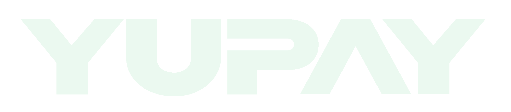

# 🚀 YUPAY - Plataforma de Comercio Digital

<div align="center">
  
  
  **Transforma tu contenido digital en ingresos**
  
  [](https://nextjs.org/)
  [](https://www.typescriptlang.org/)
  [](https://tailwindcss.com/)
  [](https://stripe.com/)
</div>

---

## 📋 Descripción

**YUPAY** es una plataforma completa de comercio digital que permite a profesionales, agencias y empresas vender archivos digitales de forma segura, automatizada y profesional. Es la solución perfecta para fotógrafos, diseñadores, desarrolladores, consultores y cualquier negocio que venda contenido digital.

### ✨ Características Principales

- 🔒 **Seguridad Avanzada**: Protección con JWT, control de acceso y archivos privados
- 💳 **Pagos Seguros**: Integración completa con Stripe (USD/EUR)
- 📧 **Comunicación Automatizada**: Notificaciones por email en español e inglés
- 🛡️ **Protección Anti-Robo**: Vistas previas con marca de agua
- 📊 **Panel de Administración**: Dashboard intuitivo con métricas en tiempo real
- 👥 **Experiencia de Cliente**: Proceso de compra fluido y profesional

### 🎯 Ideal Para

- 📸 **Fotógrafos** - Venta de sesiones y paquetes fotográficos
- 🎨 **Diseñadores** - Plantillas, recursos y trabajos personalizados  
- 💻 **Desarrolladores** - Código, plugins y herramientas
- 📚 **Educadores** - Cursos, materiales y recursos educativos
- 🏢 **Agencias** - Entregables y proyectos para clientes
- 💼 **Consultores** - Informes, análisis y documentación

---

## 🛠️ Tecnologías

### Frontend & Backend
- **[Next.js 14](https://nextjs.org/)** - Framework React con App Router
- **[TypeScript](https://www.typescriptlang.org/)** - Tipado estático para JavaScript
- **[Tailwind CSS](https://tailwindcss.com/)** - Framework CSS utility-first
- **[Shadcn/ui](https://ui.shadcn.com/)** - Componentes UI reutilizables

### Base de Datos & Almacenamiento
- **[MongoDB](https://www.mongodb.com/)** - Base de datos NoSQL
- **Cloud Storage** - Almacenamiento seguro de archivos

### Pagos & Comunicación
- **[Stripe](https://stripe.com/)** - Procesamiento de pagos seguro
- **[Nodemailer](https://nodemailer.com/)** - Envío de emails transaccionales

### Procesamiento & Utilidades
- **[Sharp](https://sharp.pixelplumbing.com/)** - Procesamiento de imágenes
- **[Zod](https://zod.dev/)** - Validación de esquemas TypeScript
- **[Lucide React](https://lucide.dev/)** - Iconos SVG

---

## 🎨 Características de Diseño

- **🌙 Tema Oscuro Moderno**: Diseño elegante y profesional
- **📱 Totalmente Responsive**: Experiencia optimizada en todos los dispositivos  
- **⚡ Animaciones Fluidas**: Transiciones suaves y efectos parallax
- **🎯 UX Centrada en Conversión**: Diseño optimizado para maximizar ventas

---

## 📦 Planes Disponibles

| Plan | Precio | Almacenamiento | Límite Transacción | Características |
|------|--------|----------------|-------------------|-----------------|
| **BASIC** | $19/mes | 50 GB | 1 GB | Soporte básico, analíticas |
| **PRO** | $49/mes | 250 GB | 2 GB | Soporte prioritario, retención ilimitada |
| **MAX** | $149/mes | 2 TB | 5 GB | Soporte dedicado, marca blanca |
| **ENTERPRISE** | A medida | Personalizado | Personalizado | Licencia comercial, integraciones |

---

## 👨‍💻 Autor

**Alejandro Lamas**
- 🌐 [dro.studio](https://dro.studio)
- 📧 alamas@dro.studio
- 🔗 [YUPAY Platform](https://yupay.es)

---

## 📄 Licencia

Este proyecto es propiedad de **Alejandro Lamas** y **YUPAY**. Todos los derechos reservados.

---

<div align="center">
  <p><strong>¿Listo para monetizar tu contenido digital?</strong></p>
  <p>Visita <a href="https://yupay.es">yupay.es</a> para más información</p>
</div>
```